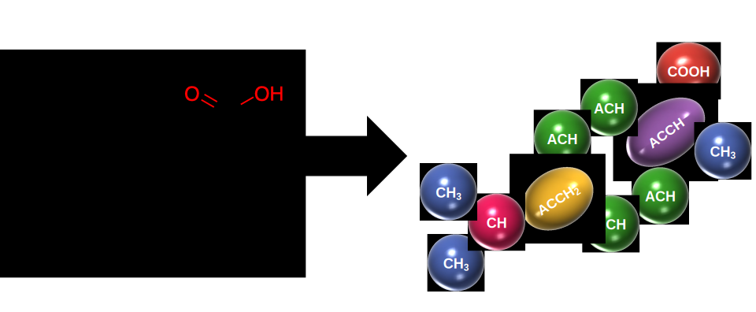

[](https://github.com/ClapeyronThermo/GCIdentifier.jl/actions)
[](https://codecov.io/gh/ClapeyronThermo/GCIdentifier.jl)
[](https://clapeyronthermo.github.io/GCIdentifier.jl/dev)
[](https://julialang.zulipchat.com/#narrow/stream/265161-Clapeyron.2Ejl)

# GCIdentifier.jl

Welcome to GCIdentifier! This module provides utilities needed to fragment a given molecular SMILES (or name) based on the groups provided in existing group-contribution methods (such as UNIFAC, Joback's method and SAFT-$\gamma$ Mie). Additional functionalities have been provided to automatically identify and propose new groups.



## Basis Usage
Once installed (more details below), GCIdentifier can easy be called upon:
```julia
julia> using GCIdentifier
```
Let's consider the case where we want to get the groups for ibuprofen from the UNIFAC group-contribution method. The SMILES representation for ibuprofen is CC(Cc1ccc(cc1)C(C(=O)O)C)C. To get the corresponding groups, simply use:
```julia
julia> (component,groups) = get_groups_from_smiles("CC(Cc1ccc(cc1)C(C(=O)O)C)C", UNIFACGroups)
("CC(Cc1ccc(cc1)C(C(=O)O)C)C", ["COOH" => 1, "CH3" => 3, "CH" => 1, "ACH" => 4, "ACCH2" => 1, "ACCH" => 1])
```
If the SMILES representation is not known, it is possible to use GCIdentifier in conjunction with [ChemicalIdentifiers](https://github.com/longemen3000/ChemicalIdentifiers.jl) where one can simply specify the molecule name:
```julia
julia> using ChemicalIdentifiers

julia> (component,groups) = get_groups_from_name("ibuprofen",UNIFACGroups)
("ibuprofen", ["COOH" => 1, "CH3" => 3, "CH" => 1, "ACH" => 4, "ACCH2" => 1, "ACCH" => 1])
```

These groups can then be used in packages such as [Clapeyron](https://github.com/ClapeyronThermo/Clapeyron.jl) to be used to obtain our desired properties:
```julia
julia> using Clapeyron

julia> model = UNIFAC(["water",(component,groups)])

julia> activity_coefficient(model,1e5,298.15,[1.,0.])
2-element Vector{Float64}:
      1.0
 421519.07740198134
```
More details have been provided in the [docs](https://clapeyronthermo.github.io/GCIdentifier.jl/dev/) where we provide additional details regarding how one can obtain the connectivity between groups, identifying new groups within a structure and how one could apply their own GC method.

## Installing GCIdentifier

The minimum supported version is Julia 1.6. To install GCIdentifier, launch Julia with

```julia
> julia
```

Hit the ```]``` key to enter Pkg mode, then type

```julia
Pkg> add GCIdentifier
```
Exit Pkg mode by hitting backspace.

Now you may begin using functions from the Clapeyron library by entering the command

```julia
using GCIdentifier
```

To remove the package, hit the ```]``` key to enter Pkg mode, then type

```julia
Pkg> rm GCIdentifier
```